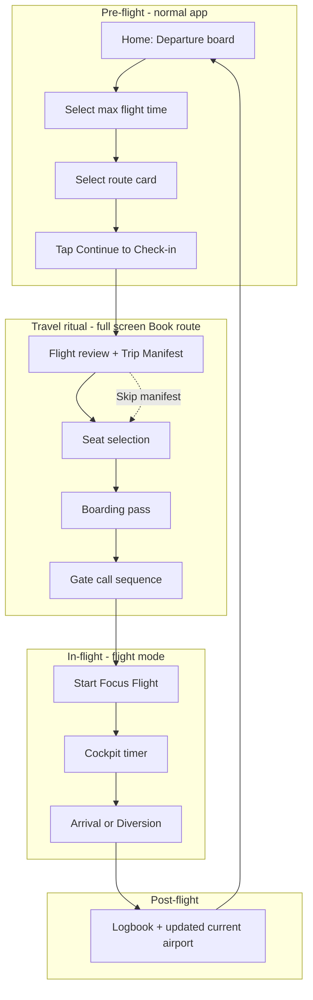

# TravelBlock Travel Ritual

This document explains how the **travel ritual** works in TravelBlock: what it is for, how a user experiences it, how the app implements it in code, and how the visual design supports a real “travel day” before a focus flight.

The ritual is **not** a pile of extra screens. It is a **single guided sequence** that turns study setup into the same mental steps you take when flying: arrive at the airport → check in → pick a seat → get a boarding pass → board at the gate → fly.

---

## 1. Product intent

### What problem it solves

A focus timer alone feels like a utility. TravelBlock’s ritual answers:

- **Where am I?** (current airport / departure board)
- **How long can I fly?** (max flight time filter — not the timer itself)
- **Where am I going?** (pick a realistic route)
- **What am I doing on this flight?** (optional manifest: objective + tag + security checklist)
- **Where am I sitting?** (seat map with realistic availability)
- **Do I have permission to board?** (boarding pass)
- **Am I leaving the terminal?** (gate call → cockpit / focus mode)

The **focus timer** starts only after the gate ritual. Its duration is the route’s **flight time** (cruise minutes from distance), not the max-time chip you used to filter departures.

### Design principles

| Principle | Meaning |
|-----------|---------|
| **Travel metaphor, real utility** | Labels sound like aviation (“Trip Manifest”, “Focus Cargo”, “Gate boarding”) but every field maps to study setup. |
| **Optional depth** | Manifest and security checks can be skipped; you can still complete a flight. |
| **One direction forward** | Primary actions sit in a **sticky footer** so “Continue” / “Board” / “Start Focus Flight” are always reachable. |
| **Cohesive system** | A **Travel day** progress rail, shared motion, and custom airline components tie steps together, not isolated forms. |
| **Normal app vs flight mode** | Before flying: light travel UI + custom TravelBlock dock. During flying: dark cockpit, booking blocked, no normal dock. |
| **Clear-sky identity** | Normal screens use bright white/sky blue, cloud-like surfaces, and compact airline-app density. Deep navy is reserved for high-contrast status moments and cockpit focus mode. |

Design note: TravelBlock visual direction is a clear-sky airline study app. Normal screens use bright white/sky blue. Cockpit is the dark focus mode exception. Boarding pass uses ticket-paper styling.

---

## 2. End-to-end user journey (logical flow)



### Step-by-step (what the user does)

| # | Real-world analogue | App step | Required? |
|---|---------------------|----------|-----------|
| 0 | Arrive at airport, read departures | **Home** — current airport, max-time selector, custom flight strips | Yes (to start) |
| 1 | Choose a flight that fits your window | Select route → **Book** | Yes |
| 2 | Check in / declare bags | **Trip Manifest** — objective, cabin tag, security checklist | No (skippable) |
| 3 | Pick seat on the plane | **Seat selection** — cabin map | Yes (default seat pre-selected) |
| 4 | Receive boarding pass | **Boarding pass** preview | Yes (auto-built from state) |
| 5 | Gate agent scans pass, clears you | **Gate call** — scan / secure / cleared | Yes (tap to start flight) |
| 6 | Airborne — no distractions | **Cockpit** — countdown = flight time | Yes |
| 7 | Land | **Arrival** or **Diversion** | Automatic or user divert |
| 8 | Trip record | **Logbook** | Automatic persist |

---

## 3. Programmatic architecture

### 3.1 Where the ritual lives

The ritual runs almost entirely inside the **Book** navigation route. It does **not** have its own bottom-tab; Book is a full-screen flow launched from Home.

| Layer | Location | Role |
|-------|----------|------|
| **App shell** | `TravelBlockApp.kt` | Holds `draftFlightBooking`, launches Book, creates `ActiveFlight` on start |
| **UI orchestration** | `BookScreen.kt` | Decides which ritual “pane” to show from `BookingUiState` flags |
| **State + actions** | `BookingViewModel.kt` | Mutates flags, seat/manifest fields, generates flight metadata |
| **Ritual visuals** | `TravelRitual.kt` | Progress rail, transitions, gate sequence, boarding reveal |
| **Shared chrome** | `TravelBlockComponents.kt` | `BoardingPassCard`, `StickyActionScaffold`, airline metrics/status pieces |
| **Domain handoff** | `BoardingPass.kt` → `ActiveFlight` | Timer duration, objective, tag cross into cockpit |

Home is **pre-ritual** (departure board). Cockpit / Arrival / Logbook are **post-ritual** but still show ritual data (focus cargo) where relevant.

### 3.2 Entry: from Home to Book

1. `HomeViewModel.createSelectedDraftBooking()` builds a `DraftFlightBooking` from the selected `FlightRoute`:
   - `durationMinutes` = route **estimated flight time** (the future timer)
   - `maxFlightTimeMinutes` = selected chip (used only for how you found the route; not shown as “buffer” on cards)
2. `HomeScreen` calls `onBookSelectedRoute(draft)`.
3. `TravelBlockApp` stores `draftFlightBooking` and navigates to `TravelBlockDestination.Book`.
4. Bottom bar is **hidden** on the Book route (`showBottomBar` excludes `book`).

Booking is blocked while `activeFlight != null` (`onBookSelectedRoute` only runs when no active flight).

### 3.3 Booking state machine

`BookingUiState` uses **three boolean flags** (plus manifest fields). `BookScreenContent` evaluates them in **priority order**:

```
1. if (!draftAvailable)           → EmptyBookingState
2. if (showBoardingPass)          → BoardingPassPreview
3. if (showGateCall)              → GateCallScreen
4. else                           → Main scroll (Manifest OR Seat) 
```

Within step 4, `showSeatSelection` chooses manifest vs seat content:

| showSeatSelection | showBoardingPass | showGateCall | Screen |
|-----------------|------------------|--------------|--------|
| false | false | false | Manifest + flight review |
| true | false | false | Seat map |
| * | true | false | Boarding pass |
| * | * | true | Gate call |

**ViewModel transitions:**

| User action | Function | State change |
|-------------|----------|--------------|
| (enter Book) | `createInitialState(draft)` | Generates flight number, gate, group, seats, times; selects first free standard seat |
| Continue to seats | `continueToSeatSelection()` | `showSeatSelection = true` |
| Skip manifest | same as above | `showSeatSelection = true` |
| Back to manifest | `returnToManifest()` | `showSeatSelection = false` |
| Generate boarding pass | `continueToBoardingPass()` | `showBoardingPass = true` (requires valid `boardingPass` computed property) |
| Back to seats | `returnToReview()` | `showBoardingPass = false` |
| Board flight | `boardFlight()` | `showBoardingPass = false`, `showGateCall = true` |
| Start focus flight | callback to app | (app-level) `ActiveFlight` + navigate Cockpit |

`boardingPass` is **not stored separately**. It is derived when origin, destination, seat, and times are all present:

```kotlin
// BookingUiState.kt — computed property
val boardingPass: BoardingPass?
    get() = /* builds from uiState fields + focusObjective + focusTag */
```

### 3.4 Ritual step enum vs UI flags

`BookingFlowStep` (`TravelRitual.kt`) labels the progress rail:

```kotlin
enum class BookingFlowStep(val label: String) {
    Manifest("Check-in"),
    SeatSelection("Seat"),
    BoardingPass("Pass"),
    GateCall("Board"),
}
```

Mapping in `BookScreen`:

| UI surface | `BookingProgressRail` step |
|------------|----------------------------|
| Main scroll, manifest | `Manifest` |
| Main scroll, seats | `SeatSelection` |
| `BoardingPassPreview` | `BoardingPass` |
| `GateCallScreen` | `GateCall` |

Manifest and seats share one `NavHost` composable but swap content via `BookingFlowTransition` + `showSeatSelection`.

### 3.5 Exit: start focus flight

`BookScreen` calls `onStartFocusFlight(boardingPass)`.

In `TravelBlockApp`:

```kotlin
activeFlight = boardingPass.toActiveFlight(startedAt = Instant.now())
navController.navigate(Cockpit) { ... }
```

`BoardingPass.toActiveFlight()` sets:

- `durationMinutes` = `focusDurationMinutes` (route flight time)
- `plannedArrivalAt` = `startedAt + durationMinutes`
- `focusObjective`, `focusTag` copied through

Bottom navigation switches to `activeFlightBottomTabs`: **Cockpit, Logbook, Store, Settings** (no Home, no Book).

### 3.6 Data generated once per booking

When the draft loads, `BookingViewModel.createInitialState()`:

| Field | How it’s created |
|-------|------------------|
| `flightNumber` | `TB` + seed from destination code + duration |
| `gate` | Letter from destination + distance mod |
| `boardingGroup` | `Group 1–4` from duration |
| `departureTime` | now + 8 minutes (display) |
| `arrivalTime` | departure + **focus flight minutes** |
| `seatOptions` | Rows 3–18, cols A–F; availability from **deterministic seed** (flight + route + date) |

Seat availability does **not** reshuffle on recomposition—same booking always shows the same map.

### 3.7 Focus cargo persistence path

| Stage | Fields |
|-------|--------|
| Manifest | `focusObjective`, `focusTag`, optional `cabinSecured`, `materialsReady`, `distractionsStowed` |
| Boarding pass card | Shows objective + tag if set |
| Active flight / Cockpit | `FocusCargoCard` if non-blank |
| Room log | `FlightLogEntity.focusObjective`, `focusTag` |
| Arrival / logbook detail | Shown when present |

Security checkboxes are **ritual-only** today—they are not persisted to the database.

### 3.8 Key files (quick reference)

```
app/src/main/java/com/travelblock/app/
├── ui/
│   ├── TravelBlockApp.kt              # draft + activeFlight + navigation
│   ├── components/
│   │   ├── TravelRitual.kt            # ritual animations, docket, gate, stamps
│   │   └── TravelBlockComponents.kt   # BoardingPassCard, StickyActionScaffold
│   └── util/HapticFeedback.kt         # ritual haptic helper
│   └── screen/
│       ├── home/HomeScreen.kt         # departure board (ritual entry)
│       └── book/
│           ├── BookScreen.kt          # ritual orchestration UI
│           ├── BookingViewModel.kt    # ritual state machine
│           └── BookingUiState.kt      # flags + computed boardingPass
└── domain/model/
    ├── DraftFlightBooking.kt          # Home → Book payload
    └── BoardingPass.kt                # Book → Cockpit payload
```

---

## 4. Visual and UX design

### 4.1 Visual language (normal screens)

The ritual uses the **light travel** theme (Material 3, soft blues, white/surface cards) with Book-specific terminal/document treatments. The Book route sits over `TravelDayBackdrop`, a subtle runway/terminal-line background that keeps the normal app light while making the ritual feel like a travel-day sequence.

| Token / component | Use in ritual |
|-------------------|---------------|
| `SoftSky` | Selected chips, check-in header, active progress step |
| `RunwayLine` | Borders on pills, chips, cards |
| `CabinAmber` | Flight number stamp, reward accents |
| `MutedText` | Subtitles, secondary labels |
| Rounded cards (16–22 dp) | Manifest, seat map, boarding pass, gate card |
| Dark terminal panels | Progress rail, route docket, gate scanner, cabin header |
| Warm paper surfaces | Manifest document and boarding pass |
| Custom action surfaces | Sticky ritual CTAs, replacing stock Material buttons in Book |

Cockpit deliberately **breaks** this palette (dark blues `#0F1D2A`) so “flight mode” feels like leaving the terminal.

### 4.2 Sticky action footer

Every ritual step uses `StickyActionScaffold`:

- Scrollable content has bottom padding (`StickyActionFooterHeight` = 112 dp) so dual-button footers clear the final scroll content.
- Primary/secondary buttons float above the scroll area in a elevated `Surface`.
- Bottom nav is already hidden on Book, but this also keeps CTAs visible on small phones without scrolling to the end.

**Per-step actions:**

| Step | Primary | Secondary |
|------|---------|-----------|
| Manifest | Continue to Seat Selection | Back to Departures |
| Seats | Generate Boarding Pass | Back to Trip Manifest |
| Boarding pass | Board Flight | Back to Seats |
| Gate call | Start Focus Flight (enabled after sequence) | — |

### 4.3 Travel day progress rail

`BookingProgressRail` is always at the top of the active ritual scroll (except empty state).

**Visual structure:**

- Terminal label: **“TRAVEL DAY”** with **STEP n/4**
- Four columns: numbered circles → checkmarks when complete
- Labels: Check-in → Seat → Pass → Board
- `LinearProgressIndicator` = `(currentIndex + 1) / 4`

**States per circle:**

| State | Fill | Content |
|-------|------|---------|
| Done | Terminal blue | ✓ icon |
| Active | Sky blue | Step number |
| Upcoming | Soft sky surface | Step number (muted) |

This gives constant orientation: the user always knows which phase of travel day they are in.

### 4.4 Step-by-step visual design

#### A. Home (clear-sky departure dashboard) — ritual prelude

Not part of `BookScreen`, but sets the tone:

- **Terminal status header** — TravelBlock, current airport, at-gate/ready status, local time, and points.
- **Gate-sign airport panel** — bright surface with IATA large, ICAO subtitle, airport name, city/state, status chips, and subtle route/gate styling.
- **Departure board** — white/sky-blue board with duration chips, route rows, dividers, loaded/total count, and compact selected-row expansion.
- **Route rows** — destination IATA, airport/city, **flight time**, distance, earn points, availability label (Best match, Short hop, etc.).
- Sticky **Continue to Check-in** terminal action footer with route duration and reward context.

#### B. Flight review (persistent in manifest + seat steps)

Always visible above the transitioning content:

- **`CompactRouteDocket`** — one line: `ORIGIN → DEST · X min · Y mi · TB### · Gate ##` plus boarding group subtitle
- Uses a blue route-strip treatment so it reads as an airline itinerary, not a generic summary card.
- Replaces the older FROM/TO mini cards + multi-metric flight summary card (less scrolling)

#### C. Trip Manifest — check-in counter

**`CheckInCounterHeader`:**

- Bright check-in banner, “Check-in counter”
- Blue-accented **flight number** (TB###)

**`ManifestCard`:**

- Section **Trip Manifest** / “Declare your focus cargo…”
- Mission objective (multiline field)
- **Cabin tag** chips (Homework, Studying, Coding, …) — toggle select
- **Security check** — three compact clearance tiles (cabin, materials, phone/distractions)
- **Skip manifest and choose seat** — outlined escape hatch
- Objective input uses `FocusCargoField`, a light focus-cargo field rather than a stock `OutlinedTextField`.

**Motion:** `BookingFlowTransition` uses **fade + horizontal slide** with direction: forward steps slide in from the right; back to manifest slides in from the left (280 ms in, 180 ms out).

**Security check:** Compact clearance tiles, not full-width stacked forms.

#### D. Seat selection — cabin map

- Bright cabin header reinforces that the user has moved from check-in into the aircraft cabin without making the whole normal app dark.
- **CabinSeatMap** — light cabin-map panel, rows 3–18, A–F, labeled aisle gap C|D, custom seat shapes
- Color language: standard (light) / extra legroom (soft sky) / premium (amber tint) / unavailable (faded gray)
- Legend pills at top of map
- Selected seat called out in header pill

#### E. Boarding pass — document reveal

Full-screen pane (`showBoardingPass`).

**`BoardingPassReveal` animation:**

- On first composition: `visible` flips true after `LaunchedEffect`
- Enter: **fade** + **slide from right** + **scale 0.94 → 1** (480 ms, `FastOutSlowInEasing`)
- Triggers haptic `boardingPassIssued` when the pass pane opens (if haptics enabled in Settings)

**`BoardingPassCard` content:**

- TravelBlock Air header + flight number chip; stronger paper-like elevation
- Ticket-white generated-document paper, subtle texture, passenger row, edge notches, and stronger shadow
- Large origin / destination codes + cities
- **`PerforatedDivider`** (dashed line)
- Seat, gate, boarding group, depart/arrive, focus flight minutes
- Objective + cabin tag when set
- Barcode in a dark **SCAN AT GATE** panel (decorative bars + flight number)
- Animated **`READY TO BOARD`** stamp (scale/fade in, rotated)

#### F. Gate call — leaving the terminal

Full-screen pane (`showGateCall`).

**Copy:**

- Headline: “Gate {gate} now boarding”
- Subtitle: leaving terminal → Focus Mode

**`GateBoardingSequence`:**

- Copy: **`{boardingGroup} now boarding at Gate {gate}`** and **“Cabin doors close when Focus Mode starts.”**
- Dark scanner console with grid/frame treatment and animated **scan line** (infinite horizontal sweep, 1200 ms loop)
- Three rows driven by `gateStep` (0 → 1 → 2):
  1. Scanning boarding pass
  2. Securing cabin
  3. Cleared for departure

**Row visuals (`GateSequenceRow`):**

- Pending: dim terminal row
- Active: white circle + amber dot, scale 1.02, semibold label
- Done: amber circle + check icon

**Timing (BookScreen `GateCallScreen`):**

```kotlin
LaunchedEffect(flightNumber) {
    delay(700); gateStep = 1
    delay(700); gateStep = 2
}
```

Primary button: **disabled** with **“Preparing cabin…”** until `gateStep >= 2`, then enabled **“Start Focus Flight”**. Haptic `gateCleared` on clear; `focusFlightStarted` on depart.

Full-screen surfaces (check-in, pass, gate) use **`BookingRitualSurfaceTransition`** for left/right slide between phases.

Footer copy reminds: timer = `boardingPass.focusDurationMinutes`.

#### G. Cockpit — airborne (ritual payoff)

- Dark immersive UI (not ritual components, but ritual data appears)
- **`FocusCargoCard`** if objective/tag set — “Focus Cargo” + tag chip + objective text
- Timer = `ActiveFlight.durationMinutes` from boarding pass

#### H. Arrival / Logbook — ritual echo

- Arrival may show **Focus cargo** card (tag + objective)
- Logbook flight detail shows tag chip + objective when saved

---

## 5. Animation and motion summary

| Component | Type | Duration / behavior |
|-----------|------|---------------------|
| `BookingFlowTransition` | `AnimatedContent` directional horizontal | 280 ms in, 180 ms out; forward = slide from right |
| `BookingRitualSurfaceTransition` | `AnimatedContent` between check-in / pass / gate | 300 ms in, 220 ms out |
| `BoardingPassReveal` | `AnimatedVisibility` fade + slide + scale | ~480 ms ease-out |
| `GateBoardingSequence` scan bar | `InfiniteTransition` | 1200 ms repeat |
| `GateSequenceRow` | `animateFloatAsState` scale + alpha | 280 ms when active |
| `BoardingPassStatusStamp` | scale + fade | ~420–520 ms |
| Progress rail | Static + linear progress | Updates on step change |

All motion uses **Compose Animation** only—no Lottie or extra libraries.

---

## 6. What the ritual does *not* do (boundaries)

- **Does not** change flight duration at gate—duration was fixed at route selection.
- **Does not** require manifest or security checks to proceed.
- **Does not** charge seat upgrade points yet (selection only checks balance).
- **Does not** persist security checkbox state.
- **Does not** include taxi/boarding delay as a separate “buffer” UI—the timer is flight time only.
- **Does not** run in bottom navigation—Book is a dedicated full-screen route.

---

## 7. Extending the ritual (intended hooks)

Documented future improvements that fit the same system:

| Hook | Idea |
|------|------|
| Home departure board | Animate list updates when max-time chip changes |
| Manifest continue | Stamp animation on “Continue to Seat Selection” |
| Cockpit entry | “Wheels up” transition from gate → dark cockpit |
| Security checks | Optional sound when all three checked |
| Ritual haptics | Seat select, boarding pass, gate cleared, focus start (`TravelBlockHaptics`; gated by Settings) |
| Background | Gate / landing notifications (`docs/NOTIFICATION_PLAN.md`) |

New steps should extend `BookingFlowStep`, update the progress rail, and follow the same **flag + full-screen pane + sticky footer** pattern.

---

## 8. Mental model for developers

**Think of the ritual as a small state machine inside one Composable tree:**

1. **One ViewModel** owns all booking fields.
2. **Three booleans** pick which full-screen pane renders.
3. **One enum** drives the progress rail and transitions on the shared scroll pane.
4. **One domain object** (`BoardingPass`) hands off to flight mode.

If a new step feels like “fluff,” ask: *does it map to a real travel action, does the progress rail advance, and does something animate forward?* If not, it probably belongs outside the ritual (e.g. Settings, Store).

---

## 9. Related documentation

- `docs/UX_SPEC.md` — product-wide UX direction  
- `docs/PRODUCT_SPEC.md` — focus flight loop  
- `docs/NOTIFICATION_PLAN.md` — post-ritual landing alerts  
- `MANUAL_TEST_PLAN.md` — hands-on verification of the full sequence  
