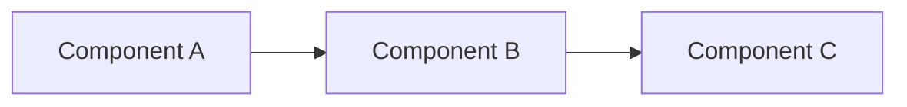
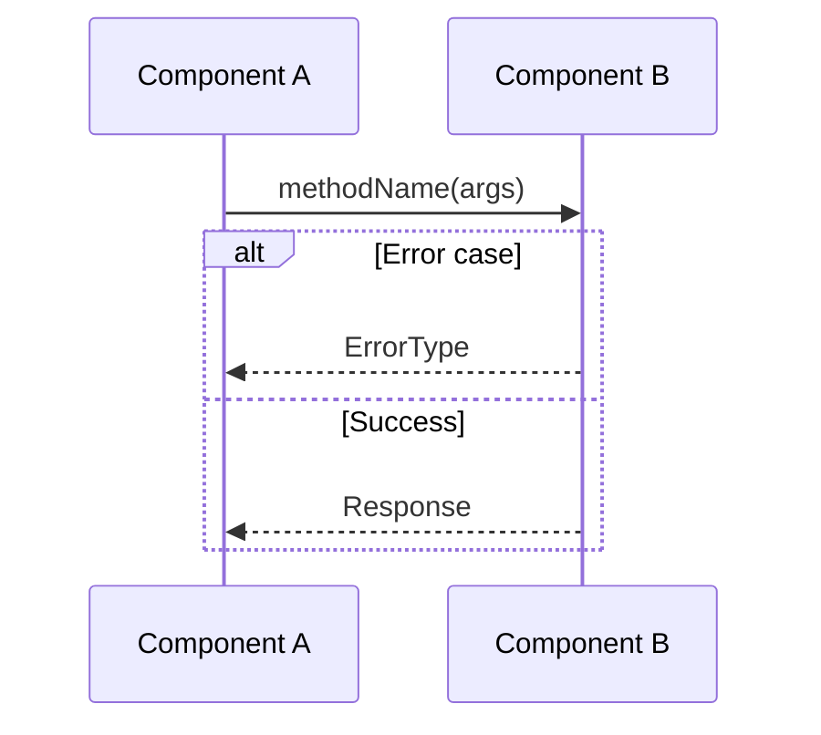

# PRD: Add "Seatbelt Chime" sound on start.


**Complexity: 4 → MEDIUM mode**
- Selected roadmap item needs a concrete implementation plan
- Includes implementation and verification work

```
COMPLEXITY SCORE (sum all that apply):
+1  Touches 1-5 files
+2  Touches 6-10 files
+3  Touches 10+ files
+2  New system/module from scratch
+2  Complex state logic / concurrency
+2  Multi-package changes
+1  Database schema changes
+1  External API integration

| Score | Level  | Template Mode                                   |
| ----- | ------ | ----------------------------------------------- |
| 1-3   | LOW    | Minimal (skip sections marked with MEDIUM/HIGH) |
| 4-6   | MEDIUM | Standard (all sections)                         |
| 7+    | HIGH   | Full + mandatory checkpoints every phase        |
```

---

## 1. Context

**Problem:** This PRD covers the roadmap item "Add "Seatbelt Chime" sound on start.". The roadmap item needs a concrete implementation plan.

**Files Analyzed:**
- `ROADMAP.md` — selected roadmap item source
- `AGENTS.md` — repository instructions

**Current Behavior:**
- The roadmap item is still pending implementation.
- Night Watch needs a usable PRD file at the selected output path.
- The planner should preserve the selected roadmap item and write a real document for it.

### Integration Points Checklist

**How will this feature be reached?**
- [ ] Entry point identified: <!-- e.g., route, event, cron, CLI command -->
- [ ] Caller file identified: <!-- file that will invoke this new code -->
- [ ] Registration/wiring needed: <!-- e.g., add route to router, register handler, add menu item -->

**Is this user-facing?**
- [ ] YES → UI components required (list them)
- [ ] NO → Internal/background feature (explain how it's triggered)

**Full user flow:**
1. User does: <!-- action -->
2. Triggers: <!-- what code path -->
3. Reaches new feature via: <!-- specific connection point -->
4. Result displayed in: <!-- where user sees outcome -->

---

## 2. Solution

**Approach:**
- Analyze the existing code paths that the roadmap item touches.
- Describe the target architecture, implementation sequence, and tests.
- Keep the PRD focused on the single selected roadmap item and the exact output file path.

**Architecture Diagram** <!-- (MEDIUM/HIGH complexity) -->:



**Key Decisions:**
- Reuse the existing PRD template structure already used by the repository.
- Prefer concrete file paths and test names over vague placeholders.
- Keep the plan actionable even when the provider output needs a local fallback.

**Data Changes:** None

---

## 3. Sequence Flow <!-- (MEDIUM/HIGH complexity) -->



---

## 4. Execution Phases

**CRITICAL RULES:**
1. Each phase = ONE user-testable vertical slice
2. Max 5 files per phase (split if larger)
3. Each phase MUST include concrete tests
4. Checkpoint after each phase (automated ALWAYS required)

### Phase 1: [Name] — [User-visible outcome in 1 sentence]

**Files (max 5):**
- `src/path/file.ts` — what changes

**Implementation:**
- [ ] Step 1
- [ ] Step 2

**Tests Required:**
| Test File | Test Name | Assertion |
|-----------|-----------|-----------|
| `src/__tests__/feature.test.ts` | `should do X when Y` | `expect(result).toBe(Z)` |

**Verification Plan:**
1. **Unit Tests:** File and test names
2. **Integration Test:** (if applicable)
3. **User Verification:**
   - Action: [what to do]
   - Expected: [what should happen]

**Checkpoint:** Run automated review after this phase completes.

---

### Phase 2: [Name] — [User-visible outcome in 1 sentence]

**Files (max 5):**
- `src/path/file.ts` — what changes

**Implementation:**
- [ ] Step 1
- [ ] Step 2

**Tests Required:**
| Test File | Test Name | Assertion |
|-----------|-----------|-----------|
| `src/__tests__/feature.test.ts` | `should do X when Y` | `expect(result).toBe(Z)` |

**Verification Plan:**
1. **Unit Tests:** File and test names
2. **Integration Test:** (if applicable)
3. **User Verification:**
   - Action: [what to do]
   - Expected: [what should happen]

**Checkpoint:** Run automated review after this phase completes.

---

## 5. Acceptance Criteria

- [ ] All phases complete
- [ ] All specified tests pass
- [ ] Verification commands pass
- [ ] All automated checkpoint reviews passed
- [ ] Feature is reachable (entry point connected, not orphaned code)
- [ ] - [ ] The selected roadmap item is documented in the expected PRD file
- [ ] - [ ] The PRD uses the item title, section, and description from the roadmap entry
